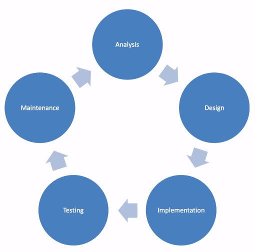
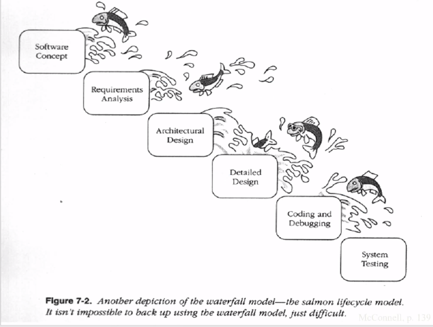
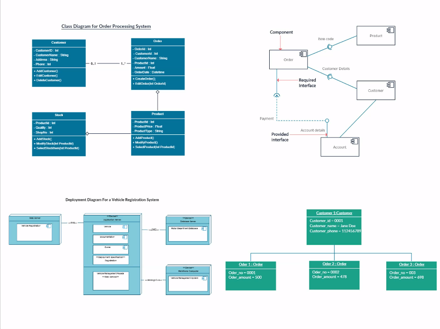
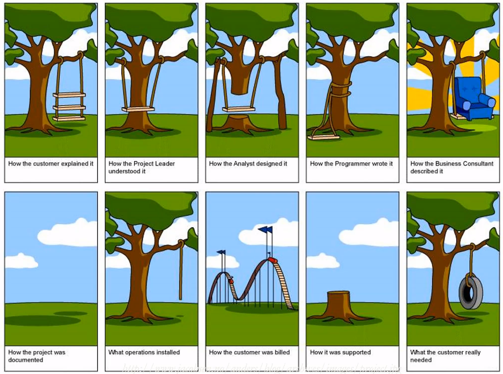

# Unit 0: Software Development
## Development
Programming so far has been all about solving a well-defined problem, with a small scope. They are standalone, meaning they don't need to rely on other components. The problem is specified by the instructor using pre-defined input. Typically, you've been working on your own. The software also has a limited lifespan.

In the 'real world', the problem may not be known or vague. The scope of the project can vary widely and tend to be integrated with other projects. The requirements are often defined by the users, who are NOT software experts. There can be many many different ways to interact with the software (front end, apis, etc). It's unpredictable. Software projects are developed by a team, and are intended for long term use, meaning a long development time.

### Software Development Life Cycle
5 phases
1. Analysis
    - Requirements gathering
    - What should the software do?
2. Design
    - What kinds of classes, technologies, are needed to solve the problem?
3. Implementation
    - Develop the actual code
4. Testing
    - import unittest
5. Maintenance
    - long term process of ensuring the software remains up to date
    

## Waterfall
- Modelled after traditional engineering processes

- It applies the phases of the [SDLC](#software-development-life-cycle) as steps in the method (sequentially)
- Pros
    - Allows us to think carefully about every step in the process
        - Determine and solve problems ahead of time with low cost
    - Integrates well with engineering processes
        - Compliant with standards
- Cons
    - Difficult to plan & schedule (unknown how long each stage will take to complete)
    - Difficult to backtrack to an earlier stage
    - A problem found late into development can be costly to fix (design flaw)
    - No software until the end of the process
    - Product is <ins>documentation</ins>
        - 
        - Diagrams go from one stage to the next
        - Not helpful to end users
        - Resistance to change (due to value from who created it)
    - May not know if product is feasible/valuable
        - Does it actually solve the problem?
    - Users only involved at the beginning and end of the process
    - Encourages roles
        - Different teams working on different things
        - Siloization
    - Limited communication between teams
        - No communication between teams aside from the documentation
        - Each team may have a different vision of the product
        - 
## Risk
