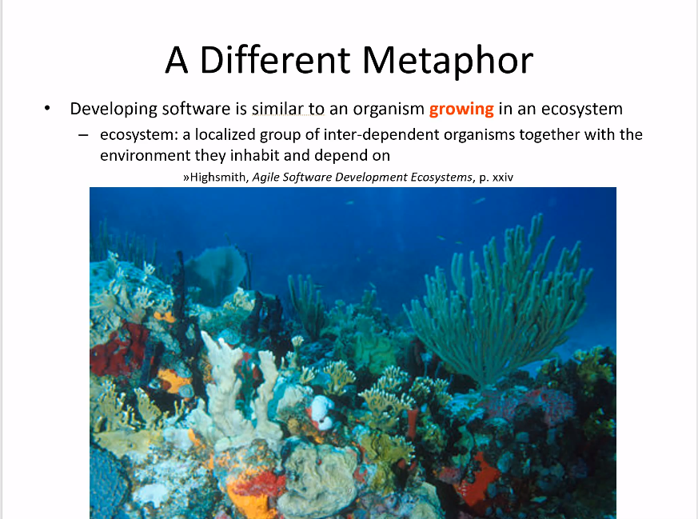
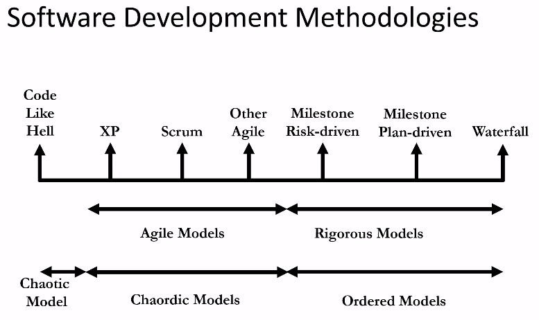

# Unit 1: Agile Software Development
## Overview

- The product we are delivering is software, not documentation or design.
  - Documentation: heavyweight
  - Product on its own: lightweight
- Priority is to deliver useful software
- Emphasis on:
  - Adaptation
  - Quality
  - Simplicity
  - Trust 
  - <ins>Communication</ins>
- A lot less rigorous than waterfall
- Spectrum of different agile processes
- 
- We're not coding like hell
- We're gonna be using...
