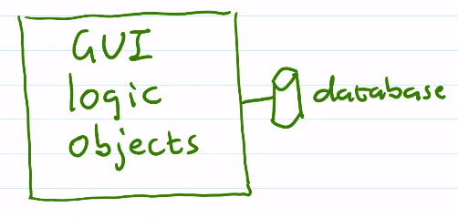
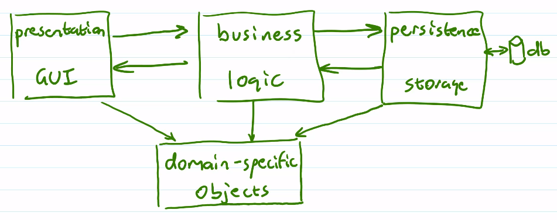

# Unit 1: Agile Software Development
## Overview

- The product we are delivering is software, not documentation or design.
  - Documentation: heavyweight
  - Product on its own: lightweight
- Priority is to deliver useful software
- Emphasis on:
  - Adaptation
  - Quality
  - Simplicity
  - Trust 
  - <ins>Communication</ins>
- A lot less rigorous than waterfall
- Spectrum of different agile processes
- 
- We're not coding like hell
- We're gonna be using...
## Our Agile Process
- Specific for this class
  

1. Strategic Planning
2. Release
   1. Release Planning
   2. Iterations
      1. Planning
      2. Development
      3. Review
   - Repeat each iteration multiple times
     - For us, 3 iterations
   3. Release Review
- Ends here, but if this was continuous development, continue with another release.
## Strategic Planing
- Produce a written [vision statement](#vision-statement)
### Vision Statement
- Describe the purpose of the project
- Process includes everyone involved in the project
  - Developers
  - Users
  - Customers
  - Managers
  - etc.
- Defines what you're going to do, NOT how
- Brief (paragraph) to long (a few pages)
- Outlines:
  - What is the project going to accomplish?
  - Who are the users of the product?
  - Why is the project valueable to the users?
  - What are the success criteria?
    - Have to be specific, concrete, and quantifiable
  - May contain other things
    - Future directions
    - Metaphor
- This is a document for a general audience, not just developers
  - Terminology can refer to the domain, but nothing from the developers
  - <ins><b>NO TECHNICAL DETAILS</b></ins>
## Metaphor
Ex. `A stack is implemented as a linked list with pointers to nodes ending in null`
- None of those things actually exist
- `null` is a metaphor for 0 is a metaphor for low voltage signal

ex. Auction software
- Ebay
  - Happens over the span of a week or so
- Auction house
  - Happens live over the course of a minute
- Dutch auction
  - Start high, work low
- First price sealed bid
  - Highest bid without knowing other bids
  
These are all based on traditional auctions
- Refer to items and bids

Stock market
- Agents
- Boards

Bazaar
- Merchants
- Stalls
- Haggling

Rummage sale
- Table
- Buyers

Store
- Inventory
- Cart
- Checkout

Ex. A course registration system

Visit to advisor
- Suggested courses

Not required, but important for planning
## User Stories
- Intended to replace the documentation done by analysys in heavyweight software development.
- Describes what the user wants to accomplish
- Ex. `I want to be able to see my grade in a course I've taken.`
- <ins><b>NOT TECHNICAL</b></ins>
- User stories should be written by users with developer participation
  - The <ins>conversation</ins> is as important as the stories themselves
- The language is simple, not technical
- Helpful trick: Start with `As a ____, ...`
  - Ex. `As a student, ...`

## Release Planning
- Each release implements 'big' user stories (major features)
- Create stories, with time estimates & priorities
### Priorities
- Determine order of implementation
  - High
    - Functionality we need to make the product usable
    - All together make a `Minimal Viable Product (MVP)`
  - Medium
    - Valuable but not necessary
  - Low
    - May not be necessary, evaluate later
#### Pareto Principle (80-20 Rule)
80% of usability comes from 20% of features.
- Build those features first
- Part of the conversation with users
### Estimating Time
- Releases (and iterations) are timeboxed
- Implement what we can in fixed time
- Cost of story: estimated time to implement
- Determined primarily by devs
- Unit based on timebox
## Planning Game
### Big User Stories
- Users & devs create stories
- Devs estimate cost
- Users prioritize, based on estimates & time
- Cost estimation can be a game
  - Ex. planning poker
    - Each dev secretly estimates cost
    - Share simultaneously
    - Close -> agreement
    - If not -> discussion further, repeat
- Long estimates are less accurate
  - Break down into smaller stories & estimate again
- Too many short stories can be difficult to manage
  - Merge together if it makes sense
- Estimating process gets easier as time goes on
### Small User Stories
ex. Big story `Show me details about the courses I've completed.`
- Letter grade
- Calculate my GPA
- How many credit hours left in my degree
  
Shared
- `Generate my transcript` would use the same small stories
  
Prioritized separately from big user stories
- High priority small stories are necessary for big stories

Highest priority big stories will be broken down & planned for this release
- *Just enough* planning -> YAGNI
  - You Aren't Gonna Need It
  - Might not need something in your planning

## Iteration Planning Using Developer Tasks
Describe the technical tasks that need to be completed to implement stories.

Each is a single activity.

Each has a time estimate, based on small units, like single developer hours

The development team works together to make the tasks in a brainstorming activity.

Ex. Letter Grade
- Allow the student to identify themselves by student number. `3 hours`
- Retrieve a list of course numbers the student has taken. `5 hours`
- Get a course name for a course number. `2 hours`
- Display a list of courses ordered by name. `6 hours`
- Pick a course from the list. `2 hours`
- Look up a student's letter grade for a course. `2 hours`
- Create a database, populated with data. `10 hours`

Typically done on sticky notes.

Some tasks may be shared by several stories.

Split long tasks (typically less than 10 hours)
- Ex. Split database task:
  - Determine the table structure. `6 hours`
  - Create an empty database. `4 hours`
  - Populate db with fake data. `2 hours`
  
Dev tasks are assigned to devs

Task estimation can use a planning game.
- Ex. bid time estimates, lowest bid gets the task.
## Project Architecture

- Low cohesion
  - Too many things in one place
  - makes the system unnecessarily difficult to work with
- Tight coupling between components
  - Know too much about each other
  
BAD

Need high level organization of components with well defined communication
- System architecture

### 3 Layer Architecture

Components are <ins>only</ins>allowed to communicate as described by the arrows.

Reflected in code structure
- Separate Java packages
