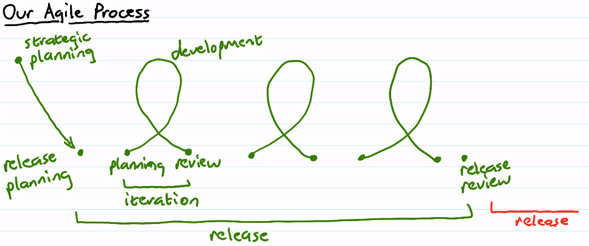

# Unit 1: Agile Software Development
## Overview

- The product we are delivering is software, not documentation or design.
  - Documentation: heavyweight
  - Product on its own: lightweight
- Priority is to deliver useful software
- Emphasis on:
  - Adaptation
  - Quality
  - Simplicity
  - Trust 
  - <ins>Communication</ins>
- A lot less rigorous than waterfall
- Spectrum of different agile processes
- 
- We're not coding like hell
- We're gonna be using...
## Our Agile Process
- Specific for this class
  

1. Strategic Planning
2. Release
   1. Release Planning
   2. Iterations
      1. Planning
      2. Development
      3. Review
   - Repeat each iteration multiple times
     - For us, 3 iterations
   3. Release Review
- Ends here, but if this was continuous development, continue with another release.
## Strategic Planing
- Produce a written [vision statement](#vision-statement)
### Vision Statement
- Describe the purpose of the project
- Process includes everyone involved in the project
  - Developers
  - Users
  - Customers
  - Managers
  - etc.
- Defines what you're going to do, NOT how
- Brief (paragraph) to long (a few pages)
- Outlines:
  - What is the project going to accomplish?
  - Who are the users of the product?
  - Why is the project valueable to the users?
  - What are the success criteria?
    - Have to be specific, concrete, and quantifiable
  - May contain other things
    - Future directions
    - Metaphor
- This is a document for a general audience, not just developers
  - Terminology can refer to the domain, but nothing from the developers
  - <ins><b>NO TECHNICAL DETAILS</b></ins>
