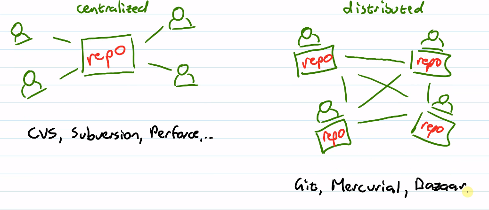

# Version Control
## Version Control Systems
- Stores code and resorces for project in a repository
- Manage different versions of our system
  - Tracks changes
  - Metadata
    - Datetime
    - Authors
    - Reasons for changes
    - Maintains history:
      - Compare
      - Rollback to past state
  - Allows for collaboration
    - Devs can share project for simultaneous work
    - Share changes
    - Manages conflicting changes to the project
- 2 models

- Distributed can have a central server
  - Github
  - Gitlab

## Git
### Operations
- Working copy (working directory)
  - Version you're currently using
- Checkout
  - Switch working copy to different version
- Commit
  - Save any changes you've made to working copy as a new version in your repository
  - Described with a meaningful commit message
- Add
  - Stage changes to be added to the commit
  - Staging
- Clone
  - Make your own local copy of a remote repo
  - It knows its origin
- Push
  - Send commited changes back to remote repo
- Fetch
  - Get changes from remote repo
- Merge
  - Put together different changes
- Conflict
  - When multiple developers have been working on the same code and the changes overlap
  - Must be resolved before merge is complete
- Pull
  - Fetch & merge together
### Branching
- Alternate path of changes
- Allows for multiple simultaneous sets of work
- In git, a branch is a separate version
- You can switch between branches and merge em
- Branches can exist locally or remotely
- Trunk: master branch
- Head: most recent change
  - `HEAD`: end of branch that you're working on
- Can have as many branches as you like
- Tag: name applied to a particular commit
  - Version, iteration, etc.
  - Easy to locate a milestone
### Github Flow
- All changes are done in branches
  - Feature branches
    - Every change is created in a separate branch and merged back when it's done
- Make changes to local copy and commit to local
- Pull Request
  - You want others to pull your changes
  - To see them, discuss them, decide if they're done
  - Hold conversations through PR
- When change is done, merge back to master

