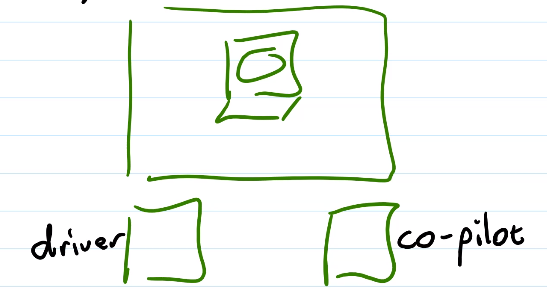

# Unit 4: Agile Practices
## When is the task done?
- Must meet all requirements:
  - When it completes the entire task
  - Passes a thorough set of tests
  - Meets the team coding standards
  - Is readable and modifiable
  - Works with current version of project
  - Has to be peer reviewed
- Once the requirements are met, the code is `done done`
- Then, can be used in the project
### Technical Debt
- Accumulation of bad decisions in code and design
- Sign code filled with `hacks`
  - Ex. 
    ```java
        list.sort //crashes if list is null or empty
        //change it to 
        if(list != null && !list.isEmpty())
            list.sort();
    ```
    - Fix sort empty list
    - Why is list even null?
- Results
  - Increasing elaborate hacks
  - Fixed defects re-appear
  - Team thinks the code is hacked together
## Agile Techniques
- User/Customer participation
- Planning game
- Short iterations & frequent releases
- Simple design
### Valuable Practices
- Peer review
- Coding standards
  - Team-wide style guidelines
  - File structure, naming, indentation, spacing, commenting
  - Used consistently 
- Collective ownership
  - Everyone on the team is responsible for <em>all</em> the code in the entire product
  - Anyone can change any code at any time
- Test-first
- Refactoring
  - The improvement of existing code without changing beahviour
  - Constant improvement in code and design quality
## Continuous Integration
- Integration: Merging new code with the existing project
- Do it very frequently
- Requirements:
  - A canonical "current" version of the project
  - Repo contains entire project
  - Build must be as automated as possible
    - Ideal: install tools, clone repo, build w/ one action
  - Build is <em>fast</em>
  - Build is <em>self-testing</em> - test suite runs on each build
  - Well-defined tasks are completed (done-done) regularly
    - Then integrated
    - Daily commits
  - Don't wait to end of iteration to integrate!
## Pair Programming

- Driver has the keyboard
- Co-pilot focuses on high-level
- Switch roles & partners frequently
- Can be done remotely by screen sharing
- Shares expertise, decision-making
