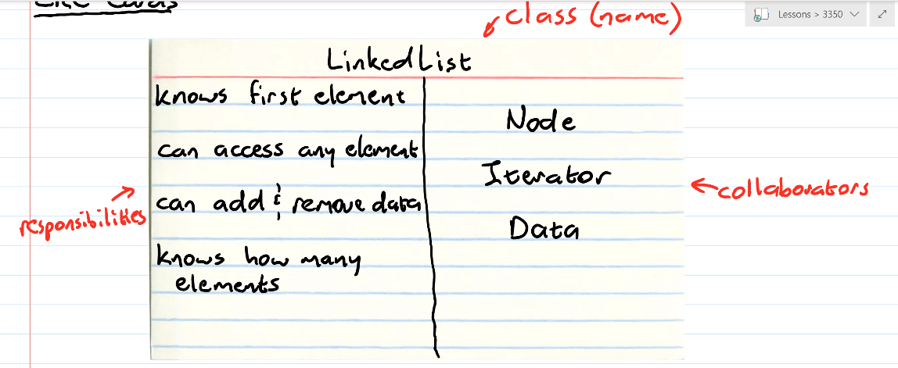
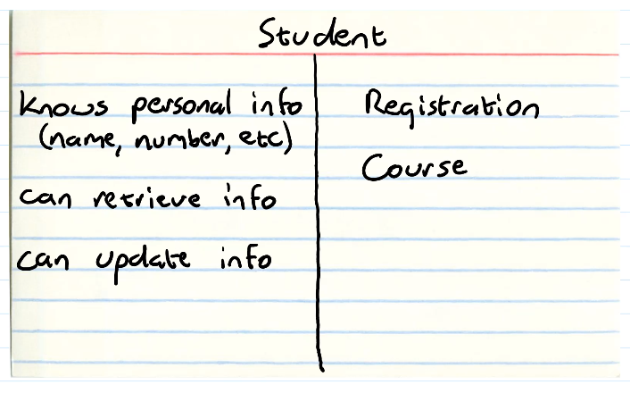
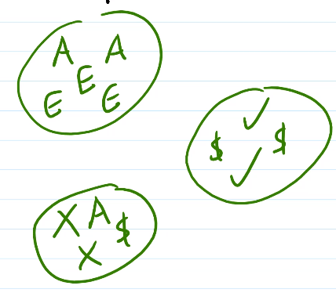
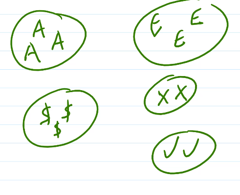
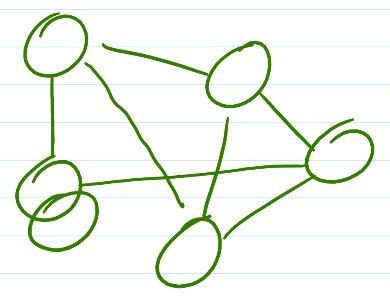
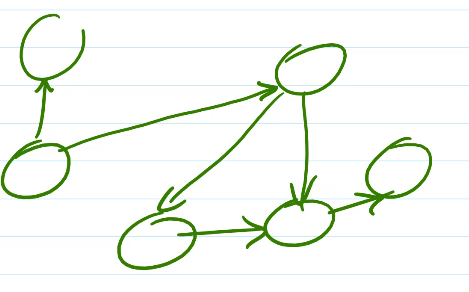
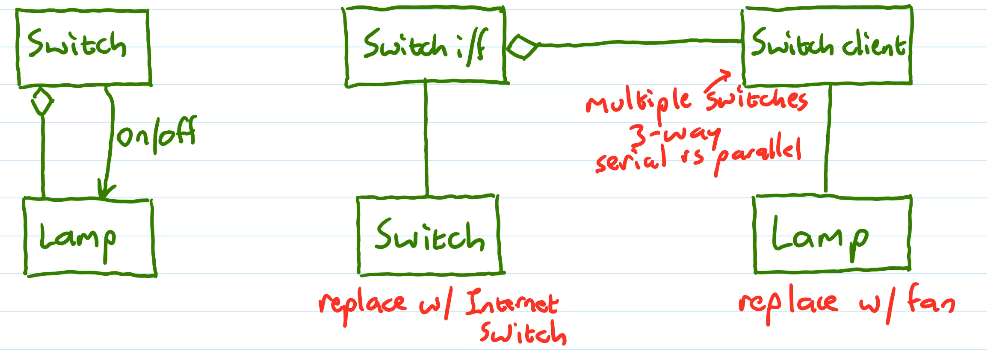

# Unit 5: Design Principles
## CRC Cards
- Index cards!
- Class
  - Name of component
- Responsibilities
  - What it can do
    - High level
- Collaborators
  - Other components it works with
  


## Beck's Principles
- Well designed code must:
    1. Run (and pass) all tests
    2. Not contain any duplicate code
       - Be easy to change
    3. Express all ideas that author(s) intended to express
        - Like a story
        - Be readable & meaningful
    4. Minimize classes and methods
   
- (ordered by priority)
## Coupling and Cohesion
### Cohesion
- The strength of relationships within a component
- Low cohesion
  - Each component contains loosely related elements
  - 
  - BAD
- High cohesion
  - Each component contains one kind of element
  - 
  - GOOD
- Ex. Student
  - High cohesion
    - `getName()`
    - `updatePhoneNumber()`
  - Low cohesion
    - `emailStudent()`
      - Should be in email component
    - `changeGradeInCourse()`
      - Should be in registration component
    - `findAStudentWithTheSameName()`
      - List of students
### Coupling
- Strength of relationships across components
- Tight coupling
  - Too many dependencies
  - 
  - BAD
- Loose coupling
  - Few, well-defined means of communication between components
    - Unidirectional over bidirectional
  - 
  - GOOD
- ex.
  - Tight coupling
    - Classes include each other
- Benefits of high cohesion & loose coupling
  - Testability
    - Less to disconnect
  - Maintainability
    - Fewer consequences to changes
  - Reusability
  - Simplicity
## DRY
- Don't Repeat Yourself
- Avoide duplication, re-use modules instead
- Includes copy & paste and duplicate functionality
- Refactor to eliminate
- Makes maintainability difficult
## LoA
- Levels of Abstraction
- Hide complexity of a system
  - Using a public interface and private implementation
- Usually many levels
- Can focus on one level at a time
  - Easier to understand
  - Faster to navigate
## SoC
- Separation of Concerns
- Each component has one job ("concern")
- ex. Student stores info about one student
- ex. Container vs. content
- ex. HTML/CSS/JS
## PLA
- Principle of Least Astonishment
- Avoid surprises
- Ex. Java
    ```java
    int i = 3;
    i = i + 0.7; //fails to compile
    i += 0.7;    //compiles
    ```
- Ex.
  ```java
  doA(long p);
  doB(long p);
  doC(long p);
  doD(int p);
  ```
- Ex. on closing before opening
  - ||db|file|net
    |-|-|-|-|
    |open| | | |
    |read||||
    |close|✔|✔|❌|
## LoD
- Law of Demeter (Principle of Least Knowledge)
- An object should know as little as possible about any other object
- Given method M in object O, M can call methods on
  - M's parameters
  - O's members
- But not on any values returned from those calls
- "Don't talk to strangers"
- Ex. `student.getCourses().findCourses("3350") //❌`
  - Change to `student.findCourses("3350") //halfway there`
  - `registrations.findCourses(student, "3350")`
- Ex. `course.getName().substring(5) //to get code`
  - Replace with `course.getCourseNumber()`
## SOLID Principles
### SRP
- Single Responsibility Principle
- Each class does only one thing
- Has only one "reason to change"
- Ex. (violations)
  - Calculate and print GPAs
    - Change b/c GPA calculation changes
    - Change b/c output format/destination changes
    - Two reasons to change -> separate
    - More subtly -> calc only, return rounded string like `3.80`
- Caution: violations usually come later
### OCP
- Open/Closed Principle
- Classes should be open for extension but closed for modification
- Polymorphic OCP
- Ex.
  ```java
  if (inputDevice == MOUSE)
  {
      pt = getMouseClick();
  } 
  else if (inputDevice == TOUCH)
  {
      pt = getTouchPress();
  }
  else ...
  ```
  ❌
  - Instead...
  ```java
  interface Action 
  {
      Point getAction();
  }
  class Mouse implements Action 
  {
      Point getAction()
      {
          //...
      }
  }
  pt = device.getAction();
  ```
  - The Action is closed for modification, but open for extension
  - Can also extend action for new functionality
  ```java
  interface MultiAction extends Action
  {
      Point[] getSecondaryActions();
  }
  if (device instanceof MultiAction)
  {
      //...
  }
  ```
### LSP
- Liskov Substitution Principle
- A superclass can always be meaningfully replaced by an instance of its subclass.
- Ex. (violation)
  - Rectangle class
    - Width
    - Height
    - Get/set
  - Square class subclass of Rectangle
    ```java
    class Square extends Rectangle
    {
        public void setWidth(int w)
        {
            super.setWidth(w);
            super.setHeight(w);
        }
        public void setHeight(int h)
        {
            super.setWidth(h);
            super.setHeight(h);
        }
    }
    ```
  - PROBLEM:
  ```java
  void f(Rectangle r)
  {
      r.setWidth(3);
      r.setHeight(4);
      assert r.getArea() == 12;
      // Passes for Rectangle, but not for Square
  }
  ```
  - Violates LSP 
  - Cant replace rectangle with square anywhere
- Use subclasses to add functionality, not change functionality
### ISP
- Interface Segregation Principle
- Prefer client-specific interfaces over general-purpose ones
- Ex.
  - File io goes to Reader & Writer
    - If you have a read only device, you just need the Reader files
    - `stdio.h` vs. java `FileReader`
- Ex.
  - Separate persistence layer for different objects
    - Allows for greater specialization and simplicity
### DIP
- Dependency Inversion Principle
- Depend on interfaces, not on concrete classes
- Ex.
  - Copy operation depends on KeyboardReader and FileWriter
  - Better
  - Copy depends on Reader interface and Writer interface
- Restatement
  - A. High level modules should not depend on low level modules. Both should depend on abstractions
  - B. Abstractions should not depend on details. Details should depend on abstractions
- Pattern
  - High level component depends on some low level service and the same low level service depends on high level component
  - Replace with low level service interface, implementing it.
    - High level component depends on low level service interface
    - Create client for A which directs A's interface through the client
  - Ex.
  
     
### SOLID Example
- What happens when you need to represent something with two distinct sets of behaviours and states?
- TimedDoor class (on its own)
  - Violates SRP
- TimedDoor subclass of Timer and Door
  - No multiple inheritance
- Timer superclass of Door superclass of TimedDoor
  - First link violates LSP and OCP
    - OCP? If you want to add new timers, you can't insert them into this structure
- Fix: Apply DIP and delegate responsibilities
  - TimedDoor subclass of Door
  - Intermediary TimerClient
  - TimedDoor contains TimerClient
  - TimerClient sends Notification to TimedDoor
## Decoupling
- Services are another way of looking at relationships between components in our system
  - A component provides a service to our application
  - May have different implementations of a service
  - Can coexist, can switch over time, or switch at run-time
- Prerequisite: Different implementations mush share a common interface
  - Gives us loose coupling we need
  - Services are decoupled by respecting the DIP
- An alternative service can be chosen
  - Client talks to service through intermediary (controller)
  - Many Services, controller constructs a service by default
  - Client requests service to service controller
  - Client either recieves service from controller or uses controller as if it were the service
  - Controller manages state & requests
## Dependency Injection
- Switch services while program runs
- Implementations
  1. Constructor
     ```java
     class ServiceController
     {
         ServiceI service;
         public ServiceController()
         {
             service = new DefaultService();
         }
         public ServiceController(ServiceI s)
         {
             service = s;
         }
     }
     ```
     - Default for default service
     - Alternate for other implementations
  2. Framework (template pattern)
     ```java
     class ServiceController
     {
         public ServiceController()
         {
             service = new DefaultService();
         }
     }
     class ServiceControllerAlt extends ServiceController
     {
         public ServiceControllerAlt()
         {
             service = new AltService();
         }
     }
     ```
  3. Setter
     - Controller changes service on-the-fly
     ```java
     interface Service
     {
         void do();
     }
     public ServiceController // implements ServiceI
     {
         private ServiceI service;
         public ServiceController()
         {
             service = new DefaultService();
         }
         public void changeService(ServiceI newService)
         {
             service = newService;
         }
         // if implements interface
         public void do()
         {
             service.do();
         }
     }
     ```
- Why Dependency Injection?
  - Ex. dynamically swap out persistence layers
    - Ex. fake persistence for testing
      - Faster & more predictiable
  - Completely isolates alternate service
    - Ensures we never use testing db in production
  - Ex. testing randomness
    - Have a random interface that has two implementations, one is real RNG, the other one is fake for testing purposes (set random seed for instance)
  - Ex. Domain objects
    - Should have no android specific code
    - Change architecture
      - Factory pattern
      - On presentation (or android specific), have subclasses that implement Parcelable (or serializable)
      - Inject new platform specific factory into previous factory
## Composition over Inheritance
- Implementation inheritance (extends) has limited usefulness
- Use only for relationships where it makes sense
  - Truly `is-a` relationships
  - Where LSP isn't violated
- Prefer extending abstract classes over instantiable classes
  - Leaf classes should be the only instantiable
- Prefer interface implementation (specification) over extends
- Options
  - Composition
    - Contained object
    - Object is owned by container
    - Ex. lines are owned by document
  - Aggregation
    - Contained object
    - Object is used by container
    - Ex. You can take engine out of car
  - Delegation
    - Pass responsibility to a contained object
    - Ex. Java Swing (inheritance)
      - `Window` <- `MyWindow`
    - Ex. Cocoa (delegation)
      - `Window` -> `WindowDelegateI` -> `MyWindowDelegate`
## Cross Cutting Concerns
- Concerns may be core or support
- Concerns may be component-specific or widespread
- Cross-cutting concerns may spread over components/architechtural layers
  - Error handling
  - validation
  - Security/authentication
  - Configuration
  - Logging
- How do we deal with these, while minimizing dependencies?
- Generally, 
  - Start with good design techniques
  - Use standard functionality
    - Standard library/language functionality
  - Design patterns
  - Use stuff specific to the concern
## Design Smells
- Observable manifestation of poor design choices
- 5 common smells
  1. Fragility
     - Changes cause the system to break
  2. Rigidity
     - Difficult to change
  3. Immobility
     - Difficult to reuse
  4. Viscousity
     - Design-preserving changes more difficult than hacks
  5. Opacity
     - Difficult to understand
     - Needlessly complex
## Anti-Patterns
- Opposite of design patterns
- Examples
  - God object
    - Does too much
  - Cut and paste programming
    - Intentional repetition
  - Error squelching
    - Hiding an error by ignoring it
  - BBOM (Big Ball Of Mud)
    - Bro what is even going on with the code
