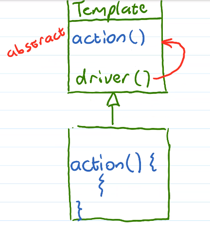
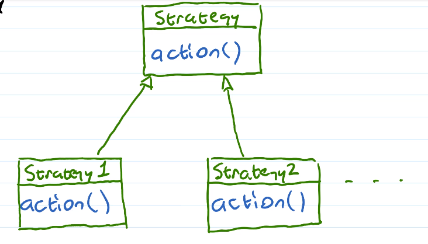
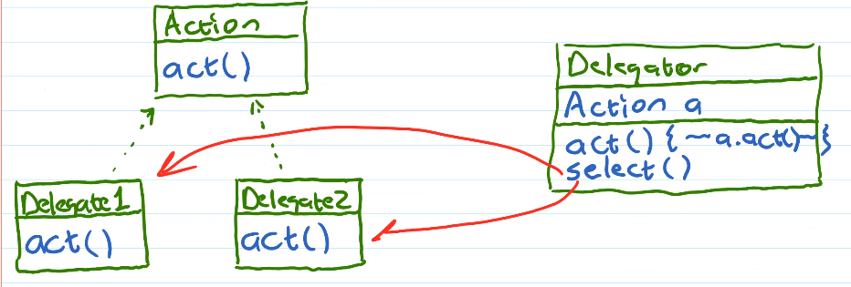
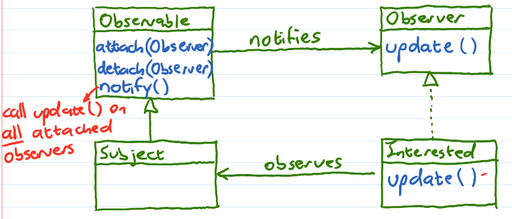
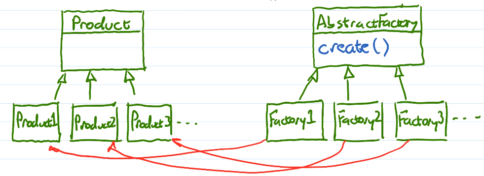
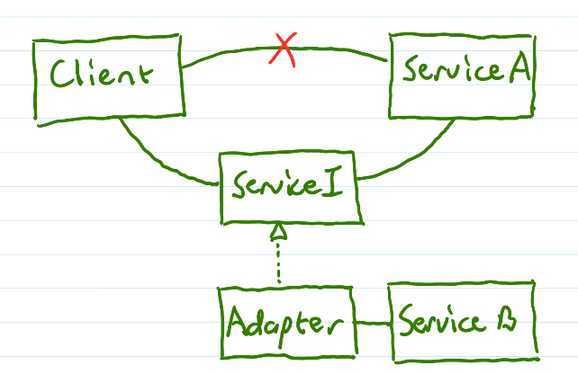
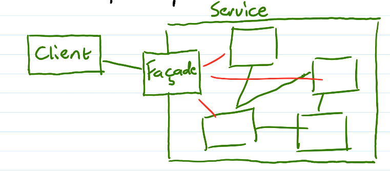
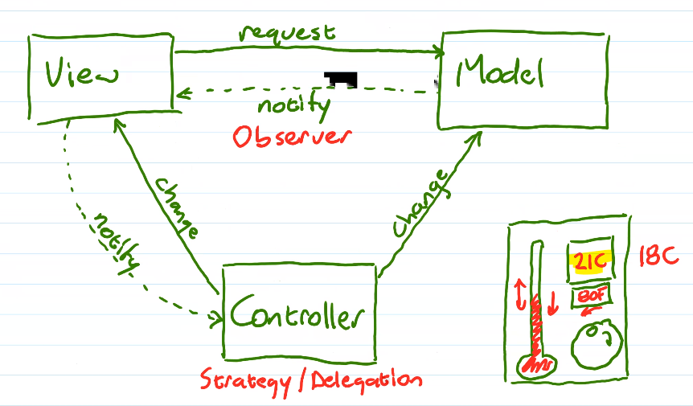

# Unit 7: Design Patterns
## Behavioural
### Template Pattern

- Default (empty) behaviours in template are overridden by more specialized behaviours in subclass
- Ex. GUI, JUnit, newtwork or other callbacks, etc.
- Don't call us, we'll call you
### Strategy Pattern

```java
void process(..., Strategy s, ...) 
{
    s.action();
}
process(..., new Strategy1(), ...);
process(..., new Strategy2(), ...);
```
- Ex. Java Comparator interface
- Mimics C function pointers, but more like the template pattern
- Chain of responsibility, where different actions are 
### Delegation Pattern

- Delegator is like a manager - chooses a delegate
- Use aggregation to change behaviours
  - Changes from is-a relationship to can-do
- Ex. `Dog` class `bark()` method
  - Traditionally
    - `LittleDog` "yip!"
    - `BigDog` "woof!"
  - With this new pattern
    ```java
    public interface BarkAction
    {
        public String bark();
    }
    public class LittleDogBark implements BarkAction
    {
        public String bark()
        {
            return "yip!";
        }
    }
    public class BigDogBark implements BarkAction
    {
        public String bark()
        {
            return "woof!";
        }
    }
    public class Dog
    {
        private BarkAction barkAction;
        public String bark()
        {
            barkAction.bark();
        }
        public void createBigDog()
        {
            barkAction = new BigDogBark();
        }
        public void createLittleDog()
        {
            barkAction = new LittleDogBark
        }
    }
    ```
### Iterator
- Encapsulate the state required to traverse a collection of data
- Iterator interface
  - `getData()`
  - `next()`
- LinkedList
  - LLIterator
  - Node pointer
- ArrayList
  - ALIterator
  - int index
- They can be tightly coupled with the containment class
- Have a List interface (see COMP 2140)
- `List myList = new ....();`
- `Iterator i = myList.createIterator();`
  - Automatically gets the right iterator
  ```java
  for (Item i : myList) //generic loop
  {
      //process i
      //specific behaviour
  }
  // Compared to
  for(int i = 0; i < al.size(); i++) //specific loop
  {
      Strategy.act(al.get(i)); //generic behaviour
  }
  ```
### Observer
- Notify interested objects about state changes


- Ex. Subject is a news source, Interested is some number of news readers
  - When Subject recieves a new news item, it calls `notify()`
  - Observable will `update()` all news readers
  - "publish-subscribe" - many-to-many
## Creational
### Singleton
- Only have one instance of an object
- Static variable only one object
- Static method getTheOnlyOne
  - Creates or returns the only object
- Private constructor for the only object
- Use only if you're sure there's only one
  - Ex. Error log
### Static Factory
- Create or return instances of an object through a static method
- More flexible error handling
- Can return objects of a different type
### Abstract Factory
- "Virtual constructor"
- Construct an object whose type is unknown until run time
  

  ```java
  void needsAProduct(..., AbstractFactory f, ...)
  {
      Product p;
      p = f.create();
  }
  ```
## Structural
### Adapter
- Problem: one service is replaced with a different (incompatible) service (different interface)
- Converts the interface of a service to a different one


- Adapter translates ServiceB's interface to look like Service A
- Ex. Database Adapter, translates DataAccessI to sql statements
### Facade
- Provide a single simple interface to a complex subsystem


- Simplifies the interface to the subsystem
- Manages creation & communication
- Makes it easier to replace the subsystem
## Architectural Design Patterns
### Model View Controller

- Model includes persistence, domain objects, and business logic
- View presents information & interface 
- Controller determines interactions between view & model
- Easy to have multiple views of the same model
