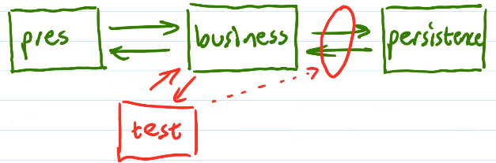
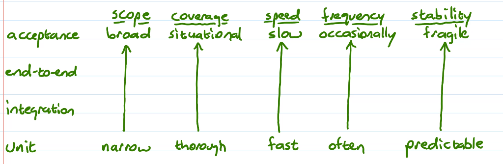
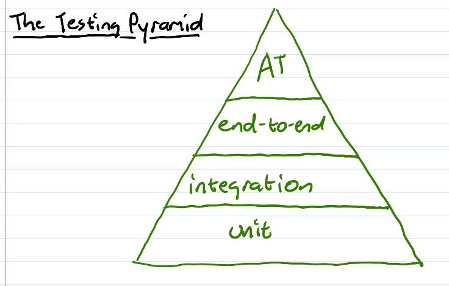

# Unit 9: High-Level Testing
## Testing with doubles
- How do we test code with dependencies?
  - Isolate parts of our system that have "depended-on components" (DoC)
- Want to focus the test on SUT, not DoC
- Need a clean "seam" between SUT and DoC (minimal coupling)
- We can replace the DoC with a test double
- A test double is a stand-in for DOC that allows SUT to be isolated for testing
- Ex. A logging system that sends serious warning messages to sysadmin
  - Tests will cause failures
    - Annoying & inefficient
  - Replace logging system with a double that acts like the real thing but doesnt actually send the email messages
- Can inject into system
- Two general kinds
  1. Stubs
  2. Mocks
### Test Stubs
- A test double that responds to requests from SUT
- Responds just enough to allow the tests to continue
  - May not need to be accurate
  - Ex. `getStudent(100)` Could return the same object regardless of the id if it satisfies the SUT for the test
- Keep it as simple as possible
- Generally want the same interface shared between DoC and stub
- Handwritten
- Simple -> Ideally shouldn't need to test it
- Can stand in for an incomplete component during development
  - Can work on other parts of the system earlier
  - Helps specify the interface using a simple implementation
  - Can still use for testing
- Can produce failure results to test how SUT responds
- May have multiple stubs, for testing different conditions or SUTs
- They are deterministic
  - Never fails unless we want it to
  - Ex. Replace a random number generator with a deterministic generator for testing
- Fast
- Can expose internals, for testing
### Mocks
- Another kind of test double
- (Usually) responds to requests from SUT <em>and</em> verifies the interaction between the SUT and DoC
- Ex. Access to db requires a sequence of actions
  - Create connection
  - open 
  - query
  - close
  - A mock can check that we do all these correctly
- Just like a stub, inject mock to replace DoC
- A mock is built from <em>expectations</em>
  - Actions that the mock expects to receive from SUT
  - Must meet expectations to pass the test
  - May be strict (required, in sequence) or lenient (optional)
- Hard to write by hand
  - Use a framework that defines expectations at a higher level
  - Ex. JMock, EasyMock, Mockito
## Integration Tests

1. Integration test focused on seam
  - Ex. between business & persistence
  - Execute a typical sequence of calls
  - Ex. open db, get student, check info, get their registered courses, get gpa, set/change grade, close db
  - This is a test: Verify after each!
  - Include error and invalid situations
2. Integration test focused on use of external resource
  - Same kind of things as 1
  ---
- Each integration test focuses on <em>one</em> resource or <em>one</em> resource
  - Can use a test double, if we are still testing the seam
- Use JUnit
- Slower to execute than unit tests
  - Executed less frequently
  - Fewer than unit tests
  - Less thorough than unit tests
- Tests should be executed locally (on dev system) where possible
- Integration tests document the API of a component and its usage
- Integration can space multiple seams
  - Tests across all layers: end-to-end tests
## Acceptance Testing
- Test the outcomes of our entire system
  - Does user interaction produce the correct results?
  - Not UI testing
- Go back to the user stories
  - Think/write in terms of the problem domain
  - Write a script: A sequence of actions that a user might use to solve a typical problem
  - Based on the "confirmation" part of user story process
- Ex. Edit Students story
  - Find student #400
    - Name is Mary Bailey
    - Address is off campus
  - Update their name and address
    - Name is Luigi Bailey
    - Address is mushroom kingdom
    - (confirm updated values appear in a new search)
  - Delete student #400
    - Student no longer exists
- This may be another test
  - List their courses
    - Confirm list and GPA is correct
  - Add a course with a grade
    - Confirm list is updated with new GPA
  - Remove a course
    - Confirm ...
  - Look for student #301
    - Confirm no results
  - Try to create a student without ID (blank)
    - Confirm error message
    - Confirm that student's name isn't there
- Create script from user stories
- Then automate them
  - <em>Espresso</em> or UI Automator
  - Allows us to programmatically apply UI controls and test for outcomes
- Scripts for each user story
  - Each test is a typical use-case scenario, representing different paths through the story, including valid (simple and complex) and invalid and error situations
  - Not as thorough as unit tests
  - Verify that the responses are correct
  - Look for particularly tricky situation
## Summary

